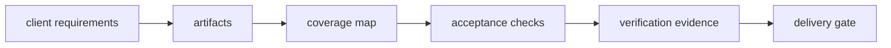

# Architecture

## Requirements
Every requirement has explicit acceptance criteria.

## Artifacts
Outputs declare which requirement IDs they cover.

## Verification
Criteria are individually recorded as passed/failed/unverified.

## Delivery gate
A delivery is ready only when there are no coverage or verification gaps.

## Design principle
Treat QA evidence as a prerequisite for delivery, not as a post-hoc explanation after generation.
